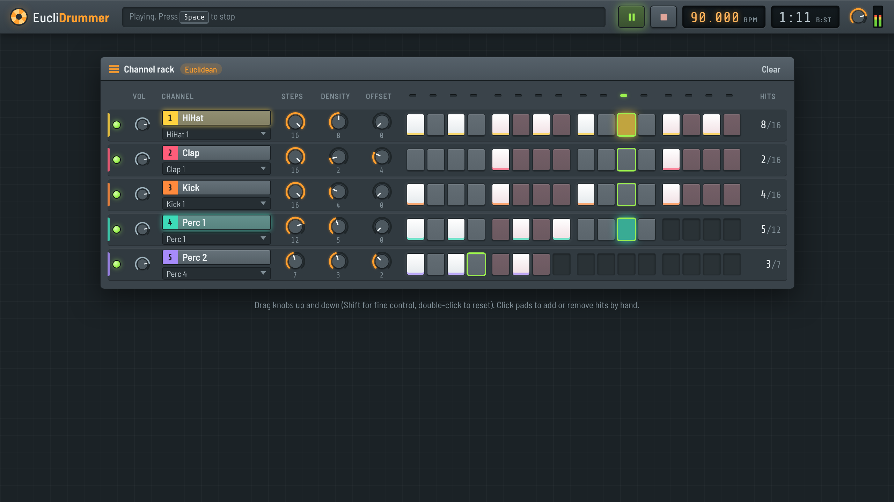

# EucliDrummer



EucliDrummer is a browser drum machine built with [p5.js](https://p5js.org/) and p5.sound. It generates rhythms with the [Euclidean algorithm](https://en.wikipedia.org/wiki/Euclidean_rhythm): you pick how many steps a pattern has and how many hits to spread across them, and the hits are distributed as evenly as possible. From there you can rotate the pattern, toggle individual steps by hand, swap samples, and change the tempo while it plays.

## Features

- Five tracks: HiHat, Clap, Kick, Perc 1 and Perc 2.
- A dark, DAW-style interface inspired by FL Studio's channel rack, with rotary knobs, lit step pads, a running playhead and a tempo display.
- Per-track Euclidean controls:
  - **Steps** sets the pattern length (0 to 16 steps).
  - **Density** sets how many hits are spread across those steps (0 to 16, capped at the step count).
  - **Offset** rotates the pattern by 0 to 16 steps.
- 16 step pads per track that show the pattern and light up as the playhead passes. Click a pad to toggle that step.
- Three samples per track, chosen from a dropdown under the track name. Click the track name to preview its sample.
- Per-track mute and volume, and a master volume with a level meter.
- Tempo from 40 to 240 BPM (90 by default), adjustable while the loop runs.
- Starts with a ready-to-play groove, and works on phone-sized screens.
- Tracks can have different lengths, so polyrhythms fall out naturally.

## Getting started

There is no build step and no dependencies to install: the p5 libraries are included in the repo.

The sounds are loaded from `assets/` over HTTP, so the page needs to be served by a local web server rather than opened straight from disk. Any static server works. For example, from the repo folder:

```sh
python3 -m http.server 8000
# or
npx serve .
```

Then open <http://localhost:8000> in your browser. In VS Code, the Live Server extension does the same job.

## How to use it

1. Press **Space** or the green play button to start the loop. Space again stops it; the play button pauses. Browsers only allow audio after you interact with the page, and either of these counts.
2. Turn a track's **Density** knob to add or remove hits. Each track starts with a groove loaded, and **Clear** in the rack's title bar empties every pattern.
3. Turn **Steps** to make a track loop over fewer steps, and **Offset** to shift where its hits land. Tracks with different step counts drift against each other, which is where the polyrhythms come from.
4. Click pads to add or remove individual hits on top of the generated pattern.
5. Pick a different sample from a track's dropdown, use the green light to mute it, and the small knob beside it for its volume.
6. Set the speed by dragging the **BPM** display up or down, scrolling over it, or focusing it and using the arrow keys. Double-click it to go back to 90.

Knobs work the same way: drag up or down (hold Shift for finer steps), scroll, or use the arrow keys, and double-click to return to the starting value.

Turning a track's Steps, Density or Offset knob regenerates that track's pattern, which replaces any steps you toggled by hand.

## How the Euclidean patterns work

A Euclidean rhythm E(k, n) places k hits across n steps as evenly as possible. E(3, 8), for example, gives `x . . x . . x .`, the tresillo rhythm, and E(5, 8) gives the cinquillo. Many traditional rhythms from around the world turn out to be Euclidean patterns, which is why a single "density" control produces musical results so easily.

EucliDrummer stores these patterns as a precomputed lookup table (`euclidArray` in `sketch.js`), indexed by step count and then by number of hits. The Offset knob rotates the selected pattern, and each track's pattern is played by its own `p5.Phrase` inside a shared `p5.Part`, which is the transport that the tempo display, the play button and the Space key control.

## Project structure

| Path | What it is |
| --- | --- |
| `index.html` | The page: toolbar, transport and the channel rack shell. Loads the p5 libraries and the scripts. |
| `sketch.js` | The app: the track table, sample loading, the Euclidean pattern table, playback, and building the channel rack. |
| `knob.js` | The rotary knob control used for every knob on the page. |
| `style.css` | The FL Studio-inspired theme, including the phone layout. |
| `docs/screenshots/` | Screenshots used in this README. |
| `assets/` | The drum samples as MP3s: three each for hihat, clap, kick, Perc 1 (`p1-*`) and Perc 2 (`p2-*`). |
| `p5.js`, `p5.sound.js` | Bundled copies of p5.js 0.9.0 and p5.sound 0.3.11. |

## Adding or replacing samples

Drop an MP3 into `assets/`, then change one of that track's sample file names in `sketch.js` to point at it. Each track has three sample slots, and its dropdown switches between them.
